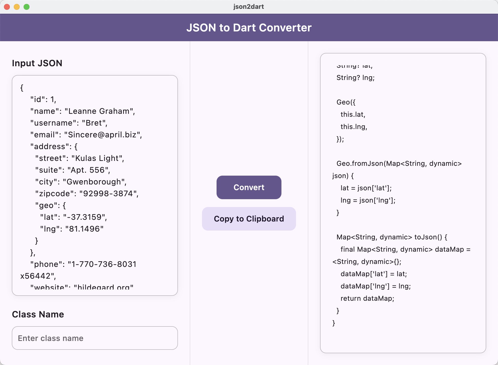

# JSON to Dart Converter

A modern Flutter web application that converts JSON to Dart classes with null safety support.

## 🌐 Live Demo
Visit the live application at: https://invincible1996.github.io/json2dart/

## ✨ Features
- Convert JSON to Dart classes with null safety
- Support for nested objects and arrays
- Beautiful Material Design 3 UI
- Instant copy to clipboard
- Proper code formatting
- Web-based - no installation required

## 🚀 Getting Started

### Online Usage
1. Visit the [live demo](https://invincible1996.github.io/json2dart/)
2. Paste your JSON in the input field
3. Enter the desired class name
4. Click "Convert" to generate Dart classes
5. Click "Copy to Clipboard" to use the generated code

### Local Development
1. Clone the repository
   ```bash
   git clone https://github.com/Invincible1996/json2dart.git
   ```
2. Install dependencies
   ```bash
   flutter pub get
   ```
3. Run the application
   ```bash
   flutter run -d chrome
   ```

## 📸 Screenshots


## 🛠️ Built With
- Flutter Web
- Material Design 3
- GitHub Actions for CI/CD
- GitHub Pages for hosting

## 📄 License
This project is licensed under the MIT License - see the [LICENSE](LICENSE) file for details.

## 🤝 Contributing
Contributions are welcome! Feel free to submit a Pull Request.
